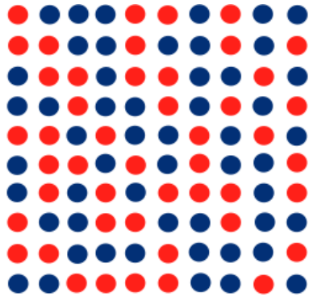
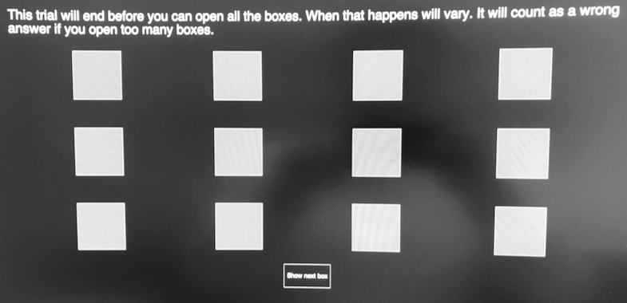
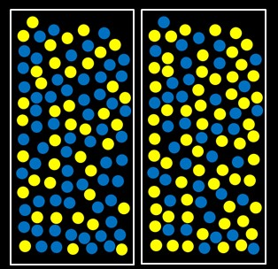
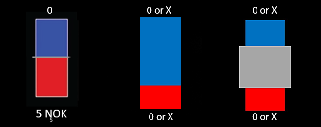
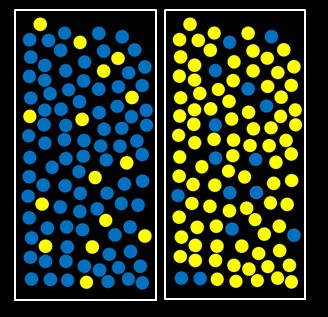
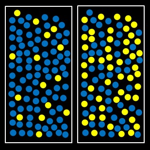
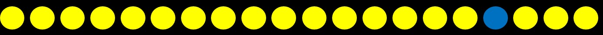

## Tiny bit of caution
<div class="notes">
The following single character keyboard shortcuts enable alternate display modes:

- 'f': enable fullscreen mode
- 'w': toggle widescreen mode
- 'o': enable overview mode
- 'h': enable code highlight mode
- 'p': show presenter notes
- 'esc': exits all modes.
</div>

*"Never start a presentation by excusing yourself"*
- Everybody

*However:*

- "fdsfdsfds" is probably a test/pilot-participant
- Speed > Robustness
- Only a select few variables
- Simple tests
  - No attention to prereg
  - No deep-dive
- Only small amounts of theory referenced
- Somewhat new to me

## Sample

- Tested in groups last Thursday
  - Counter-balanced
  - n=78 for our session
- 2.nd. year psychology students
- Will be combined with other data later on

## Overview of the session
   
 


## and more

- Questionnaires: CAPE-N, NfCS, 5DCuriosity
- In principle same ID for the rest of the four days.
  - Music study
  - Sunk-cost and risk preference-task
  - Etc etc etc.
  
## Beads counting - Effort-task(?)
<center></center>


- Participants are simply asked what colour the majority of the beads are (49 v. 51)
- If they pay *close* attention during the instructions, they will have seen that the task is introduced as a "beads counting task", however no other nudges are given
- 10 trials

## Beads counting - Does it work?
```{r, echo=FALSE}
path <- "/Users/klevjer/R Projects/Probabilistic Reasoning/Raw data/Ambiguity+Effort/" #Set to local path / directory of raw files for Ambiguity+Effort
EAmbiguity <- "EAmbiguity"
AmbiguityE <- "AmbiguityE"
EAFiles <- list.files(path = path, pattern = EAmbiguity)
AEFiles <- list.files(path = path, pattern = AmbiguityE)
EAFiles <- EAFiles[grepl("*.csv", EAFiles)]
AEFiles <- AEFiles[grepl("*.csv", AEFiles)]
EAID <- sapply(strsplit(EAFiles, split='_EAmbiguity', fixed=TRUE), function(x) (x[1]))
AEID <- sapply(strsplit(AEFiles, split='_AmbiguityE', fixed=TRUE), function(x) (x[1])) 
EAFiles <- paste(path, EAFiles, sep = "")
AEFiles <- paste(path, AEFiles, sep = "")
EAEffort <- do.call(rbind, (lapply(EAFiles, function(x) read.csv(x)[2:11,31])))
AEEffort <- do.call(rbind, (lapply(AEFiles, function(x) read.csv(x)[126:135,"key_resp_6.corr"])))
EAEffortRT <- do.call(rbind, (lapply(EAFiles, function(x) read.csv(x)[2:11,32])))
AEEffortRT <- do.call(rbind, (lapply(AEFiles, function(x) read.csv(x)[126:135,"key_resp_6.rt"])))
AEEffort <- cbind(AEEffort, AEEffortRT)
EAEffort <- cbind(EAEffort, EAEffortRT)
Effort <- rbind(AEEffort, EAEffort)
cnames <- c("Trial 1", "Trial 2", "Trial 3", "Trial 4", "Trial 5", "Trial 6", "Trial 7", "Trial 8", "Trial 9", "Trial 10", "Trial 1 RT", "Trial 2 RT", "Trial 3 RT", "Trial 4 RT", "Trial 5 RT", "Trial 6 RT", "Trial 7 RT", "Trial 8 RT", "Trial 9 RT", "Trial 10 RT", "Seq") #for seq: 1=AE, 0=EA
AEID <- AEID[-c(29,31)] #highly un-elegant solution. lappy above returns a list, with NULL values, however these are removed when stiched, and can´t seem to prevent this, so read manually.
EAID <- EAID[-1]
rnames <- c(AEID, EAID)
seq <- c(rep(1, length= length(AEID)), rep(0, length= length(EAID)))
Effort <- cbind(Effort, seq)
colnames(Effort) <- cnames
row.names(Effort) <- rnames
```

```{r, echo=FALSE}
plot(density(Effort[,11:20], na.rm = TRUE), main = "Time spent on each trial")
```

___

```{r, echo=FALSE}
hist(Effort[,11:20], xlim=c(0,50), breaks=50, main = "Time spent on each trial", xlab="Time in secounds")
```

- Median time (in s) spent on each trial: `r median(Effort[,11:20], na.rm = TRUE) `

___

```{r, echo=FALSE}
library(d3heatmap)
x <- Effort[,1:10]
d3heatmap(x, Colv = NA,Rowv = NA, col = c("blue", "red"), scale="none", cexRow = 1,cexCol = 1)
```
- Participants get on average `r mean(rowSums(x), na.rm=TRUE) ` of 10 correct.

___

- Number of participants getting x correct:
```{r, echo=FALSE}
print(table(rowSums(x)))
```

```{r, echo=FALSE}
cor1 <- (cor(Effort[,1], Effort[,11], use = "complete.obs", method="spearman"))
cor2 <- (cor(Effort[,2], Effort[,12], use = "complete.obs", method="spearman"))
cor3 <- (cor(Effort[,3], Effort[,13], use = "complete.obs", method="spearman"))
cor4 <- (cor(Effort[,4], Effort[,14], use = "complete.obs", method="spearman"))
cor5 <- (cor(Effort[,5], Effort[,15], use = "complete.obs", method="spearman"))
cor6 <- (cor(Effort[,6], Effort[,16], use = "complete.obs", method="spearman"))
cor7 <- (cor(Effort[,7], Effort[,17], use = "complete.obs", method="spearman"))
cor8 <- (cor(Effort[,8], Effort[,18], use = "complete.obs", method="spearman"))
cor9 <- (cor(Effort[,9], Effort[,19], use = "complete.obs", method="spearman"))
cor10 <- (cor(Effort[,10], Effort[,20], use = "complete.obs", method="spearman"))
```

- Median $\rho_s{trial,time}$ = `r median(rbind(cor1,cor2,cor3,cor4,cor5,cor6,cor7,cor8,cor9,cor10))`

- As can be expected with so few spending enough time on the trials as would be needed for counting
- And so many performing above chance
- *Probably* not a good effort measurement
- Need to examine: confidence ratings

## Beads drawing | DtD/JTC-task
  

- Huq, Garety, & Hemsley, 1988 (Adjusted version)
- Although often used to display jumping to conclusions in both participants with delusions (clinical samples) and delusion-prone healthy participants. It's been critizised.
- E.g., Balzan et al., 2012, poor task comprehension:
  - *same jar* & *first bead*

___
```{r, echo=FALSE}
path <- "/Users/klevjer/R Projects/Probabilistic Reasoning/Raw data/beads DtD task/" #Set to local path / directory of raw files for Ambiguity+Effort)
pattern <- "trials_2.csv"
DtDFiles <- list.files(path = path, pattern = pattern)
DtDFiles <- paste(path, DtDFiles, sep = "")
DtDN2 <- do.call(rbind, lapply(DtDFiles, function(x) sum(as.numeric(as.character(read.csv(x)[1:20,2]))))) #Some (at leaste one) values are one to high
pattern <- "trials_3.csv"
DtDFiles <- list.files(path = path, pattern = pattern)
DtDFiles <- paste(path, DtDFiles, sep = "")
DtDN3 <- do.call(rbind, lapply(DtDFiles, function(x) sum(as.numeric(as.character(read.csv(x)[1:20,2]))))) #Some (at leaste one) values are one to high
pattern <- "trials_4.csv"
DtDFiles <- list.files(path = path, pattern = pattern)
DtDFiles <- paste(path, DtDFiles, sep = "")
DtDN4 <- do.call(rbind, lapply(DtDFiles, function(x) sum(as.numeric(as.character(read.csv(x)[1:20,2]))))) #Some (at leaste one) values are one to high
pattern <- "trials.csv"
DtDFiles <- list.files(path = path, pattern = pattern)
DtDFiles <- paste(path, DtDFiles, sep = "")
DtDN1 <- do.call(rbind, lapply(DtDFiles, function(x) sum(as.numeric(as.character(read.csv(x)[1:20,2]))))) #Some (at leaste one) values are one to high
pattern <- "trials_5.csv"
DtDFiles <- list.files(path = path, pattern = pattern)
DtDFiles <- paste(path, DtDFiles, sep = "")
DtDN5 <- do.call(rbind, lapply(DtDFiles, function(x) sum(as.numeric(as.character(read.csv(x)[1:20,2]))))) #Some (at leaste one) values
```

 


```{r, echo=FALSE, fig.width=6, fig.height=4, fig.align='center'}
hist(DtDN1, main = "85/15", ylim = c(0,40), xlim = c(0,20), breaks = 20, col = "darkred")
```

___

 


```{r, echo=FALSE, fig.width=6, fig.height=4, fig.align='center'}
hist(DtDN2, main = "85/15", ylim = c(0,40), xlim = c(0,20), breaks = 20, col = "darkred")
```

___

 


```{r, echo=FALSE, fig.width=6, fig.height=4, fig.align='center'}
hist(DtDN3, main = "60/40", ylim = c(0,40), xlim = c(0,20), breaks = 20, col = "darkred")
```

___

 


```{r, echo=FALSE, fig.width=6, fig.height=4, fig.align='center'}
hist(DtDN4, main = "60/40", ylim = c(0,40), xlim = c(0,20), breaks = 20, col = "darkred")
```

___

 


```{r, echo=FALSE, fig.width=6, fig.height=4, fig.align='center'}
hist(DtDN5, main = "85/15 & 50/50", ylim = c(0,40), xlim = c(0,20), breaks = 20, col = "darkred")
```

## Beads drawing | DtD/JTC-task ?
Does it work?

- Definite improvement over the trials, trial 4 might be "useful", however 1/3 of participants still made a decision after one bead or exceeded 20.
- Trial 5 might have nudged the participants in another way "1 or 2" v. "y or b"
- Instructions
- RT's have a huge variance, indicative of participants not updating after each bead

Measure of JTC? Not convinced so far..

## Box-task


Two versions:

- 'Open all'
  - Do people bother opening all? Effort measure?
  - Do people open more than needed?
- 'Timed'
  - JTC after being "burned"?
Overall: Ratings v. Bayesian & Needed probability before making a decision

## Ambiguity-task


Levy et al. 2010

- Ambiguity v. risk
- Ambiguity: .25, .50 and .75
- Risk: .38, .25 and .13
- Using hBayesDM(cra_linear) will provide ambiguity and risk attitudes

## To be continued..

- Clean, extract, analyse, connect with the other measurements/questionnaires
- Stay tuned!

 

- Tips (..and questions) please


